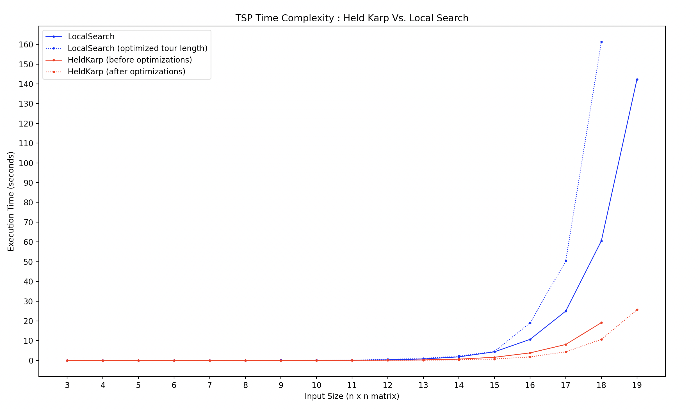
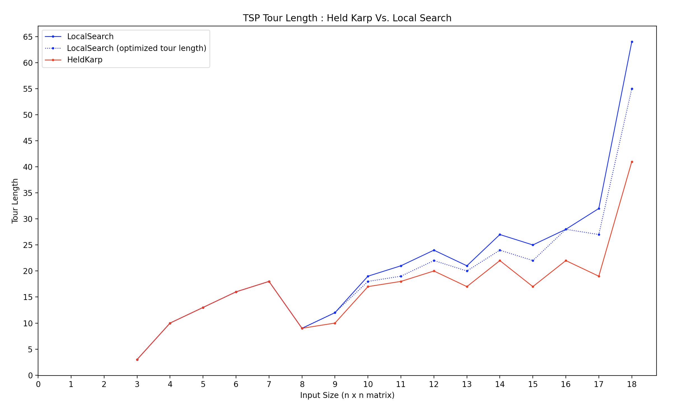

[](https://classroom.github.com/online_ide?assignment_repo_id=12836238&assignment_repo_type=AssignmentRepo)
# Traveling Salesperson Problem -- Empirical Analysis

For this exercise, you'll need to take the code from the TSP Held-Karp and TSP
Local Search exercises. This can be your own implementation or somebody else's.
You will now do an empirical analysis of the implementations, comparing their
performance. Both the Held-Karp and the Local Search algorithms solve the same
problem, but they do so in completely different ways. This results in different
solutions, and in different times required to get to the solution.

Investigate the implementations' empirical time complexity, i.e. how the runtime
increases as the input size increases. *Measure* this time by running the code
instead of reasoning from the asymptotic complexity (this is the empirical
part). Create inputs of different sizes and plot how the runtime scales (input
size on the $x$ axis, time on the $y$ axis). Your largest input should have a
runtime of *at least* an hour. The input size that gets you to an hour will
probably not be the same for the Held-Karp and Local Search implementations.

In addition to the measured runtime, plot the tour lengths obtained by both
implementations on the same input distance matrices. The length of the tour that
Held-Karp found should always be less than or equal to the tour length that
Local Search found. Why is this?

Add the code to run your experiments, graphs, and an explanation of what you did
to this markdown file.

# Time Complexity
* The max input size for my implementation for a execution time under an hour is an 18 x 18 matrix. I tried a 19 x 19 matrix, and let it run for 24 hours, and it did not execute, so for the sake of my processer, I left it at that. I was pretty dissapointed with this so I made a few changes that cut my execution times in half, and allowed a 19 x 19 matrix to run in 25 seconds and reduced the execution time of a 18 x 18 matrix input from 20 seconds to 10 seconds. However similar to the first implementation, my second implementation did not execute after running it for a full day with a 20x20 matrix, so my max input size ended up being a 19x19 matrix. 



# Tour Length
* Local search will ALWAYS have a tour length equal to or greater than the held karp implementation. Held Karp finds the exact answer, while local search has a small chance of finding the exact answer even though it is still possible. Local search picks the minimum tour length of $2^n$ tour distance calculations that each use a random cities array as input. As long as our local search uses a cities array that contains every node in the graph ONCE, it is impossible for any random ordering of the cities array to have a tour length LESS than the held karp algorithm. As you can see in the graph below, with small inputs, the local search will often find the same answer as the held karp algorithm, soley because there is a much higher probability that we will come across one of the permutations that gives the shortest tour distance visiting all nodes once. As inputs get larger, the local search becomes less and less accurate, as there is a smaller probability that it can generate a random permutaton even out of 2^n tries, that finds the same tour length as the held karp algorithm. There are many ways we could improve local search, and I have tried several of them that consistently gave me smaller, but not exact answers. The reason I stuck with the implementation below, is because there is a big trade off between runtime and memory capacity. For example you could store random generations in a cache and make sure they are not used again (which would come at a cost of lots of memory usage and runtime when searching for permutataions), or when using our counter to 2^n in the while loop, we could reset the counter to zero every time we find a path that is smaller than the current so that the local search is required to find 2^n tours that are not smaller than the current tour in order to complete (this would be very costly in terms of time execution, but would surley find smaller tour lengths than my current implementation). Just for fun, I added the second implementation I just mentioned to my graphs below, so we can see how much better / worse a counter reset method could really be.  



<u>TSP Local Search (without loop reset)</u>
```javascript
start = performance.now();
function _tsp_ls(dm) 
{
  let minDist = Infinity
  let improved = true
  while (improved)
  {
    improved = false
    let cities = dm.map((item,index) => index)
    if (cities.length <= 1) return 0
    let randomCities = getRandom(cities)
    let thisminDist = Infinity
    for (let i = 0; i < cities.length; i++)
    {
      for (let k = i + 1; k < cities.length; k++)
      {
        let route = optSwap(randomCities, i, k) // O(n)
        let sumDist = getPathDist(route, dm) // O(n) 
        thisminDist = Math.min(thisminDist, sumDist)        
      }
    }
    minDist = Math.min(minDist, thisminDist)
  }
  return minDist 
}
function tsp_ls(dm)
{
  let minDist = Infinity
  runtimes = 0
  while (runtimes < 2**(dm.length))
  {
    let sumDist = _tsp_ls(dm)
    minDist = Math.min(minDist, sumDist) 
    runtimes++
  }
  return minDist
}
function optSwap(route, i, k) 
{
  let p1 = route.slice(0, i)
  let p2 = (route.slice(i, k+1)).reverse()
  let p3 = route.slice(k+1, route.length)
  return [p1,p2,p3].flatMap(_ => _)
}
function getRandom(route)
{
  let randomRoute = route.slice()
  for (let i = 0; i < route.length; i++)
  {
    let rn = Math.floor(Math.random() * route.length);
    let tmp = randomRoute[rn]
    randomRoute[rn] = randomRoute[i];
    randomRoute[i] = tmp
  }
  return randomRoute
}
function getPathDist(cities, dm)
{
  let sumDist = 0
  for (let i = 0; i < cities.length-1; i++)
  {
    let a = cities[i]
    let b = cities[i+1]
    sumDist += dm[a][b]
  }
  return sumDist
}
let dm = [...];
console.log(tsp_ls(dm))
end = performance.now();
console.log("Execution Time (seconds): " + ((end - start) / 1000).toFixed(5))
```

<u>TSP Local Search (with loop reset)</u>

The only difference in this implementation of local search is that we require the algorithm to find $2^n$ tour lengths worse than the current tour length in order to finish. The execution time for this implementation is much worse than the original, when we use larger inputs. 

```javascript
function tsp_ls(dm)
{
  let minDist = Infinity
  runtimes = 0
  while (runtimes < 2**(dm.length))
  {
    let sumDist = _tsp_ls(dm) 
    // add loop reset mechanism 
    if (sumDist < minDist) 
    {
      minDist = sumDist
      console.log("reset")
      runtimes = 0
    }
    else
    {
      runtimes++
    }
  }
  return minDist
}
```

<u>TSP Held Karp (no optimizations)</u>
```javascript
start = performance.now();
function tsp_hk(dm)
{
    let cities = dm.map((item,index) => index)
    cities = cities.sort()  
    if (cities.length == 1) return 0;
    let cache = {}
    let minDist = Infinity
    for (let start in cities)
    {
        start = parseInt(start)
        let sumDist = tsp(cities, start, dm, cache)
        minDist = Math.min(minDist, sumDist)    
    }
    return minDist
}

function tsp(cities, start, dm, cache) 
{
    if (cities.length === 1) 
    {
        let key = JSON.stringify(cities) + start
        if (cache[key] === undefined) cache[key] = {};
        else return cache[key];
        cache[key] = dm[start][cities[0]]
        return dm[start][cities[0]];
    }
    else
    {
        let key = JSON.stringify(cities) + start
        if (cache[key] === undefined) cache[key] = {};
        else return cache[key]; 
        let minDist = Infinity;
        for (let i = 0; i < cities.length; i++) 
        {
            var nextStart = cities[i]
            let newCities = cities.filter(city => city !== start)
            let sumDist = dm[start][nextStart] + tsp(newCities, nextStart, dm, cache);
            minDist = Math.min(minDist, sumDist);   
        }
        cache[key] = minDist;
        return minDist;
    }
}

let dm = [...];
console.log(tsp_hk(dm))
end = performance.now();
console.log("Execution Time (seconds): " + ((end - start) / 1000).toFixed(5))
```
<u>TSP Held Karp (with optimizations)</u>

Here are the basic optimizations I made to cut my execution time in half
1. Ensure that the cities array is made ONCE per call 
2. Avoid redudant recursive calls by ensuring that the current start can not be used as the next start
3. Avoid rechecking answers that are already in the cache, and get rid of unessary searches in the cache

```javascript
function tsp_hk(dm)
{
    let cities = dm.map((item,index) => index)
    cities = cities.sort()
    if (cities.length == 1) return 0;
    let cache = {}
    let minDist = Infinity

    for (let start in cities)
    {
        start = parseInt(start)
        let sumDist = tsp(cities, start, dm, cache)
        minDist = Math.min(minDist, sumDist)    
    }
    return minDist
}
function tsp(cities, start, dm, cache) 
{
    if (cities.length == 1) 
    {
        let key = JSON.stringify(cities) + start 
        // avoid rechecking answers, get rid of redundant check 
        // could remove this (improved runtime, more memory)
        if (cache[key] != undefined) return cache[key] 
        cache[key] = dm[start][cities[0]]
        return dm[start][cities[0]];
    }
    else
    {
        let key = JSON.stringify(cities) + start
        if (cache[key] == undefined) cache[key] = {};
        else return cache[key];

        let minDist = Infinity;
        // make newcities once per call, instead in loop
        let newCities = cities.filter(city => city !== start) 

        for (let i = 0; i < cities.length; i++) 
        {
            // avoid redundant recursive calls
            if (cities[i] != start) 
            {
                var nextStart = cities[i]
                let sumDist = dm[start][nextStart] + tsp(newCities, nextStart, dm, cache);
                minDist = Math.min(minDist, sumDist);   
            }
        }
        cache[key] = minDist;
        return minDist;
    }
}
```

